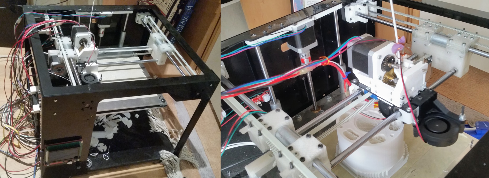
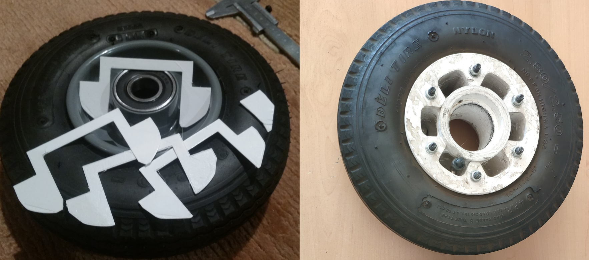
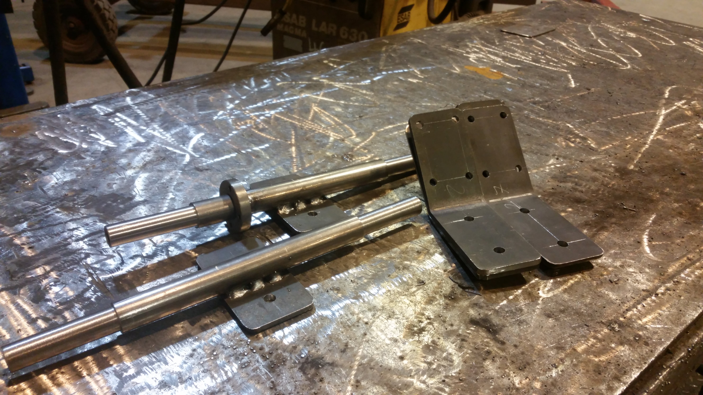
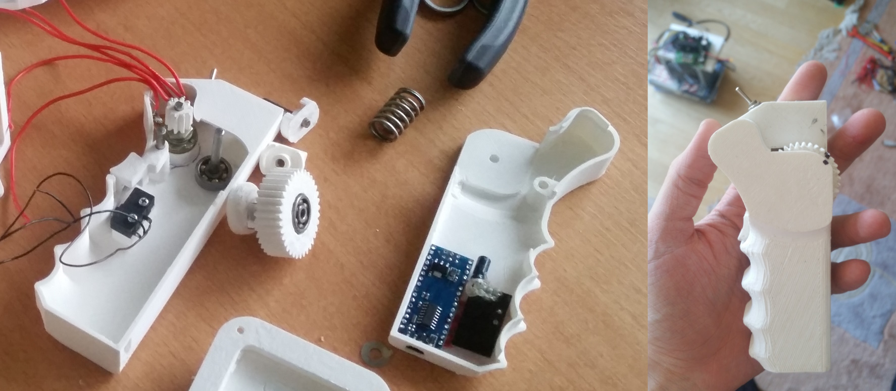
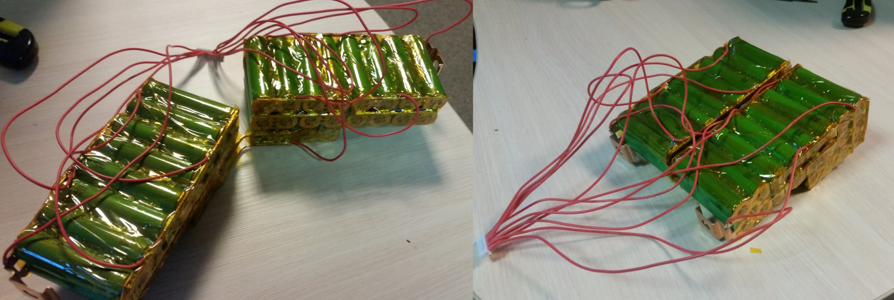
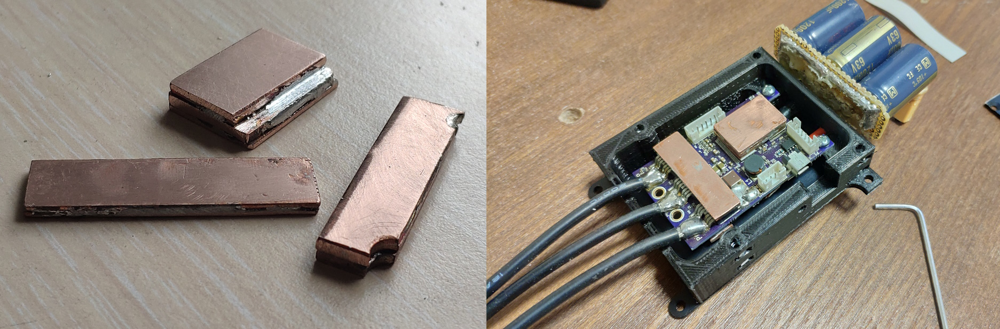

---
title: "Do-It-Yourself The Hard Way"
description: "An electric longboard."
date: 2019-06-02
tags: ["3d printing", "VESC", "personal mobility"]
banner: "/banners/eboard_banner.jpg"
featured: true
---

# Do-It-Yourself The Hard Way

An idea started invading my mind after finishing my BSc. I saw people making amazing electric longboards, some flying at speeds over 70 km/h. I wanted one. I was going to make one.

---

Being a Scrooge McDuck level cheapskate with no sense of value for time, I decided to make most components myself. This included: the battery, motor mounts, pulleys, wheel hubs, longboard trucks, and the remote. And how was an appartment dweller with no garage or workshop supposed to manufacture fairly precise load bearing components? 3D printing, of course. Mostly.

Small problem - I did not own a functional 3D printer. What I did own was a half-finished project I took over from a friend of a friend during my last year of BSc. It had a rigid steel sheet exo-skeleton frame, half finished CAD models for the XY motion system, no build plate and no extruder.

The following is a recreated build-log, since the original forum where it was posted has since disappeared.

---
## TLDR Hardware Overview

The project went through a couple of iterations. This is what I ended up with:

| | |
|---|---|
| Drivetrain | Dual HTD5 belt drive |
| Motors | 6374 Turnigy BLDC sensorless outrunners |
| Controllers | VESC 4.12 and VESC 6.6 |
| Battery | 18650 Sony VTC6 pack, 10S4P. Pushing 40A like its nothing |
| Wheels | 2.80/2.50-4 wheel barrow tires on 3D printed hubs |
| Trucks | Shin-destroying 20mm steel axles with industrial dampers for elastomers |
| Deck | Cheapest one I found |
| Remote | Pistol-grip with gearing to the pot and a dead-man's switch |
| Top Speed | 40 - 44 km/h |
| Range | 17 to 25 km

---

## The Printer

Took me about a year to manufacture the mising parts, build it, wire it, test it, solve heat-creep issues, retest, add extruder gearing and test some more. It was slightly harder than expected to get to a point where I could reliably leave it printing for 30 hours straight.

Behold the spagetti wiring. Hotglue instead of heatshrink tubing. Painter's tape as the bed surface. A4988 stepper driver orchestra. A sponge for wiping away dust from the filament. Magnificent.

 

---

## Trucks and Hubs

The wheel hubs were the first to be made. At first I wanted to print a pulley adapter that would attach to the existing steel hubs which the wheels came with. Alas due to their curvature I was never going to drill the holes accurately enough, thus I decided to print the entire hub instead.

The trucks were designed for the wheels I had - ones with some seriously oversized bearings. This led to the truck axles being oversized to suit. The dimensions are comical, all thanks to me being too cheap to buy proper offroad mountainboard wheels and trucks. Initially the board was a single wheel drive, thus there is one welded mountpoint.

---

## The remote

Back then there were few remote options. Some people were repurposing RC car remotes, but I wanted something purpose-built. I settled on a printed housing which had a spring and cam return-to-center mechanism, a geared reduction from the potentiometer to the thumb-wheel and a dead-man's switch. I wanted to use the full range of the pot with a relatively small movement of my thumb for finer throttle control. Grip ergonomics aside it was quite satisfying to use.

In terms of electronics - it's an Arduino nano clone with an NRF24L01 and an extra 63 µF capacitor for power stability, same setup is mirrored on the ESC side, providing a simple pwm signal at 100Hz refresh rate. If connection drops for more than 50ms, a smooth stop is sent to the VESC.

---

## The Battery

The heart of the board. At first I was planning to use Panasonic PF cells which had a peak discharge of 10A. That was never going to be enough, as these motors simply devour all the available current.

After I started working at Energus PS, I got a set of Sony VTC6 cells donated by the CEO (he also was a fan of DIY electrification), which are the absolute kings of current density. 10A peak? More like 10A for the entire discharge cycle with no questions asked. 

The pack features 1mm thick copper busbars which are attached to the cells via nickel wire fuses. The layout, while awkward, allowed to perfectly fit a random Aliexpress BMS in the cutout and some neoprene foam blocks ensured the pack was snug in its place.

---

## ESC Rework

Started off with a VESC 4.12, which blew its DRV chip on the first ride. I resoldered a new DRV chip, got some low ESR 1200 µF 63 V capacitors to suppress potential voltage spikes, placed them as close as possible to the controller. Also made some copper bars for effectively transferring heat away from the mosfet's and the DRV chip into some aluminium plates which made up the housing.

---

## Photos

I lost a part of the pictures, below is the final version with 2 motors. 

---
