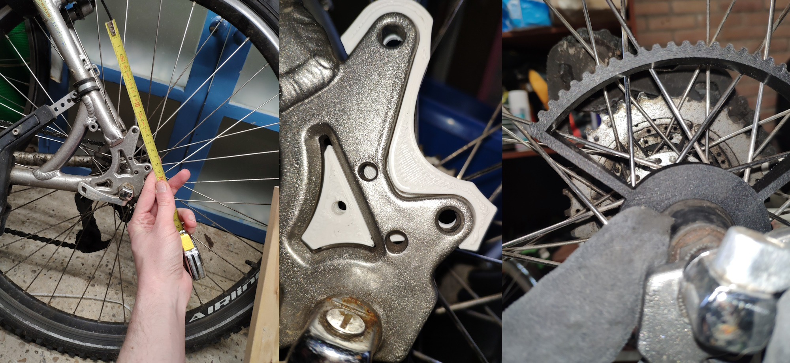
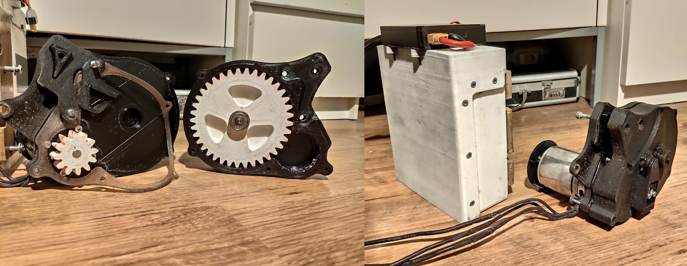
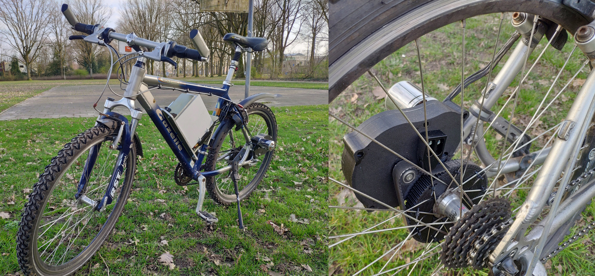
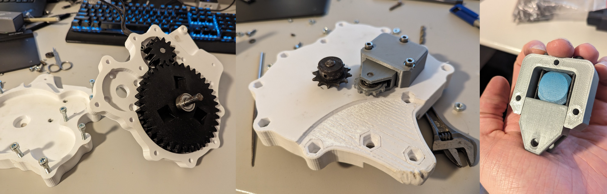

I started working on an ebike when I took up an internship which was located about 15km away. A battery, motor, belts, pulleys and ESC were left over from the earlier longboard project. I had a reliable well calibrated Ender3. I had some skateboard bearings and drive shafts from a donor laser printer. On top of that, enough motivation to beat the 40 minute bike ride. The stars had aligned.

## V1

The goal: reaching 50km/h on nominal battery voltage of 36V. The motor will run at 6.5k RMP at that voltage and I designed the reduction ratios around these numbers. I have seen people use very long belts, or friction drives for such types of ebike, but as usual, I had to do it my own way. A double reduction stage is the only acceptable answer for small outrunner BLDC's. I found some inspiration on Endless Sphere. There were excellent examples of double reduced mid-drives, but extra load on the main chain was not appealing. I went for direct rear wheel drive, mounted instead of the rear caliper.

I did not have proper datasheets for the motor I had, but I saw some rough measurements putting it at 4 Nm of torque at target speed. Ran some FEA to figure out that I need 17mm gear width at a module of 2.8 (chunky) with a SF of _maybe_ 2. Below is the completed kit.

V1 ran for well over 600km, as I used it like a booster - I almost never stopped pedaling. I melted the pinion in about 10km when I tried to run full throttle only. Some design oversights - the gearbox was not rigid enough, and as a result the belt would constantly rub on and sometimes jump off of the pulley. I did not enjoy the experience of buying a replacement belt after the sides frayed.

## V2

Main upgrades were: a chain drive, a compliant chain tensioner, rigidified gearbox, a 3D printed battery mount instead of some IKEA furniture remnants.

Unfortunately, as often happens with my projects, it remains unfinished. The ultimate version would have 2 motors, a display, a new water-proof battery case, a properly designed gearbox output shaft and I dream of replacing the chain drive with another printed gear. It remains a daily driver in the current state with the occasional gear replacement.

