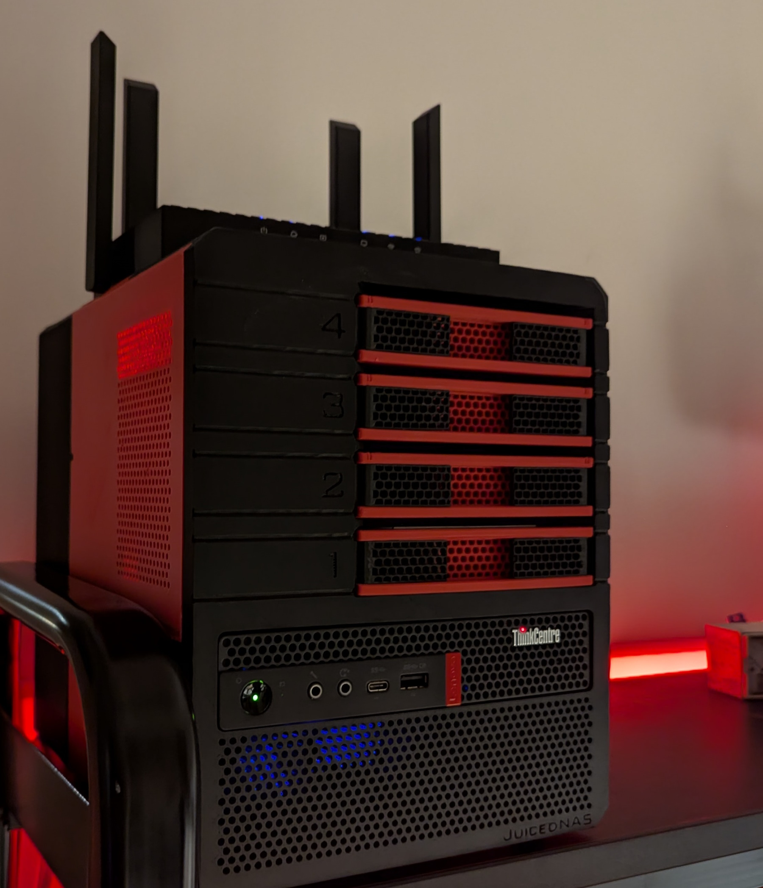
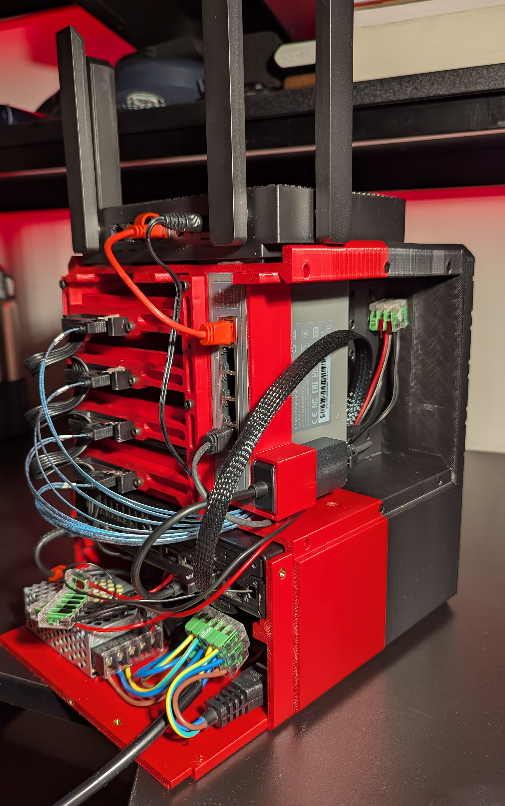

I started thinking about data management. I must be getting old. All this time, my "back-up" solution was to keep the stuff on an external HDD, probably like 90% of regular folks. That is sacrilege for anyone who frequents r/datahoarder.

Once I started looking into NAS options, my appetite for features quickly grew. Unfortunately the prices were atrocious for what was being offered. Sure, you get ease of use, but also a weak computer for the money spent that will never be more than it's creators allow it to be. That does not sit well with me.

## The DIY Route Prevails

Luckily, there were plenty of others before me that had the same thought pattern. Enter the mini PC, usually a common sight in office biomes, pretty decent ones can be had for a hundred or so euro. 

I found some very nice examples on 3d print file repositories, but I cannot help myself, I had to design my own. I wanted a compact machine, one that would make a more efficient use of volume. What can I say, I like small computers.

## Hardware Overview

Below is a list of all the stuff crammed into this case

| | |
|---|---|
| PC | Lenovo ThinkStation i3 8th gen |
| RAM | 24 Gb DDR3 |
| Storage | WD Ultrastar HC550 16TB x4 and a 500GB SSD for the OS|
| Network | 2.5G switch, USB to 2.5G dongle and a WiFi router|
| Case | 3D printed ASA because I couldn't find matte PETG |
| PSU | 20V brick for the Lenovo, 12V brick and a 5V brick for HDD's, Arduino and Cooling fan |
| Cooling | Arduino Nano controlling a 140mm fan via NTC thermistor readings |

---

