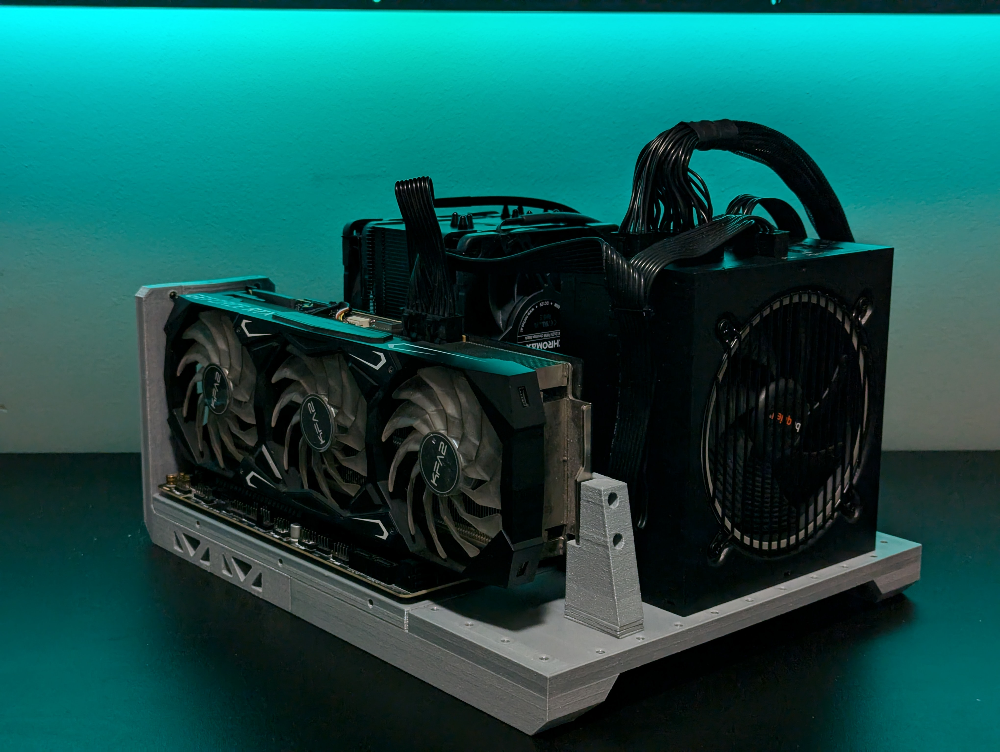

I always liked small computers, and I wanted to see how much oomph I can fit while using a micro ATX motherboard and a full sized ATX power supply. The build took place before the AI computer apocalypse, but smaller components were already overpriced, whle providing less functionality.

---

## Best Case Is No Case

I spent more time than I'd like to admit designing multiple case variants. And I only ever printed the very minimum required to have a functional computer. It's compact, but one cannot call it a real case.

| | |
|---|---|
| CPU | Ryzen 7900x |
| RAM | 64 GB DDR5 |
| GPU | RTX 3090 |
| Storage | 2x 4TB NVMe's|
| PSU | be quiet! 850W |
| Cooling | Noctua |

---

