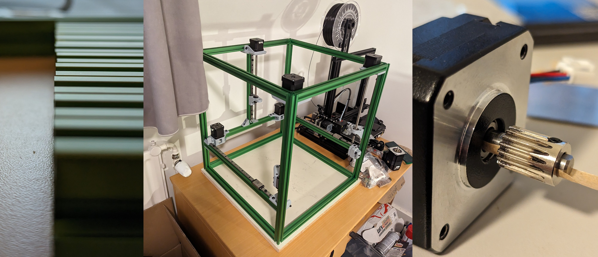
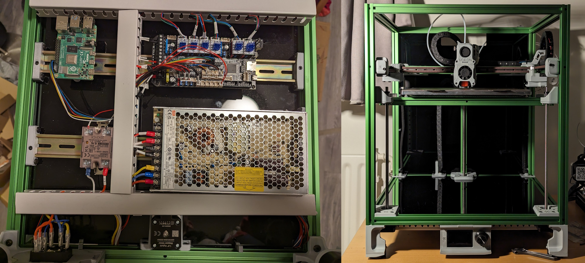
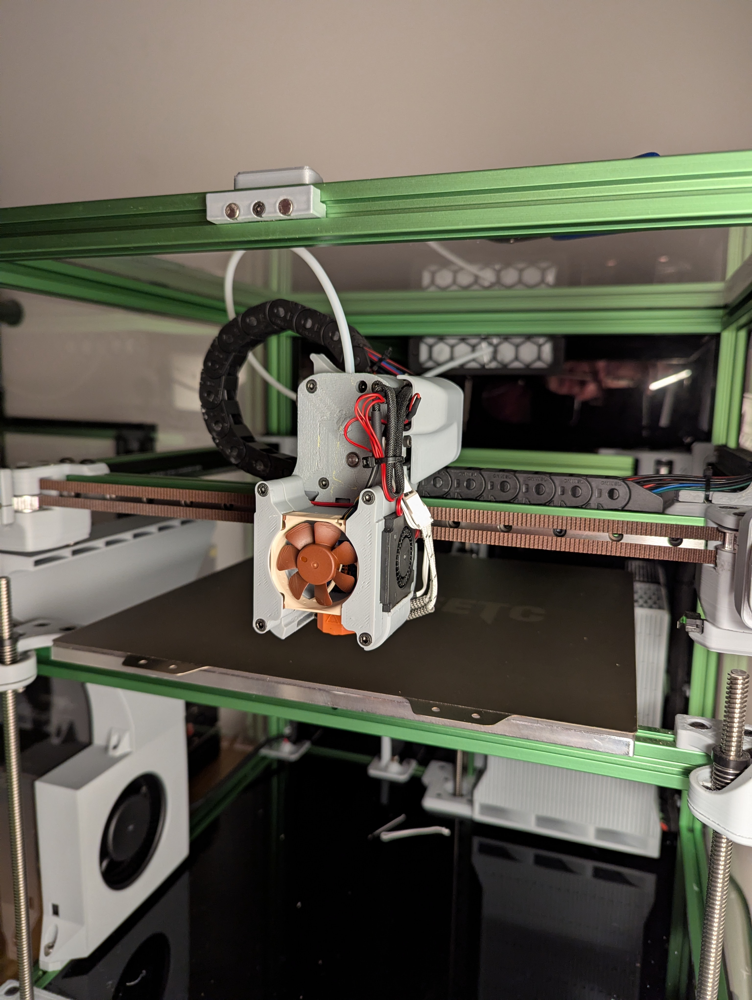

Voron Trident hardware is fantastic, the developers did an incredible job. Exactly what I always thought to be the optimal 3d printer setup: 3 point self leveling bed and core xy kinematics. Add on top a firmware that is very mod-friendly and you have a potential research platform. At least that is how I justified dropping the significant amount of fiat on a Fysetc Trident kit. 

## Building

The kit itself arrived well packed, but I quickly saw that the extrusion cuts have apparently been eyeballed. Not straight, not to length. Luckily, my workplace provided me access to a mill, where I cleaned it all up. Other than building it square and keeping rails paralel, there were a couple of other little tricks used, such as adding a thin piece of paper to reduce the extruder drive gear eccentricity. I did not have tools to measure it, but my laser eye said it was a marked improvement.

Usually the wiring in my projects is quite bad. I tried to keep it tidy here. I was also happy with my colour choice, the grey and green go together really well.

## Service Pack 1

 This was never going to remain a stock kit. But for a while, I just enjoyed the speed and quality of this machine. Unless I tried printing PLA. Then it would clog within the first few layers. Dragon HF is a nice hotend, but it needs really good cooling and the stock hotend fan was garbage. In addition, the part cooling was sub-par, a known fault of the Afterburner toolhead.

 Added a Noctua fan for the hotend, not sure why since it's only marginally better at preventing heat creep. Added two 4010 fans on the sides via minimal Afterburner modification, got an additional 12032 blower as an auxiliary part cooling fan.

 Lastly, I wanted to include a recirculating air purification system to minimize VoC's and smells during printing. I made one inspired by Bento Box: a tower with with three 5015 blowers at the base pulling air through the structure, H12 hepa filter above, and a stack of activated carbon on top. The filter assembly simply lifts off for easy maintenance.    

 

## Service Pack 2

I have had some nozzle crash mishaps, which slightly damaged the X rail carriage block. Since I will have to reassemble a large part of the printer to replace it, I will do a proper overhaul:

* Replace carriage block
* Reprint motion system parts
* Orbiter 2.5 extruder
* EBB36 toolboard
* Flap controlled CPAP cooling
* Custom ESP based camera tool
* A new-new hotend fan
* Umbilical cable instead of dragchain

Most parts have already arrived. After SP2 is in place, some interesting projects become possible and this will finally become a proper research platform.